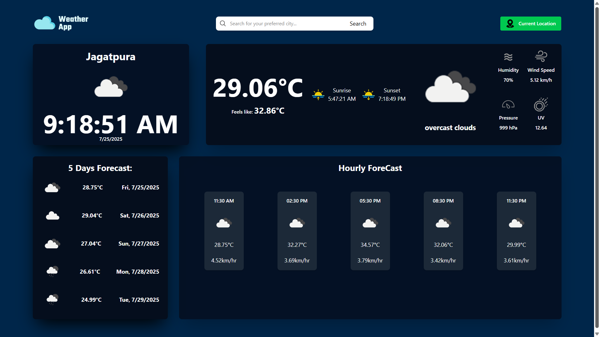

# 🌦️ Weather App

A dynamic weather forecasting app built using **React**, **Vite**, **Tailwind CSS**, and the **OpenWeather API**. This app displays real-time weather data and includes a live clock, intuitive UI, and toast notifications.

## 🚀 Features

- Live weather updates using OpenWeather API  
- Responsive UI with Tailwind CSS  
- Real-time clock using React Hooks (`useEffect`, `useState`)  
- Toast notifications with `react-toastify`  
- Deployed on GitHub Pages  

## 🌐 Live Version
This app is hosted on GitHub Pages
👉 https://amannagar04.github.io/Weather-App/

###
**API Used**: [OpenWeatherMap](https://openweathermap.org/api) 

## 📸 Preview
  

## 👤 Author

**Aman Nagar**  
GitHub: [@amannagar04](https://github.com/amannagar04)  
